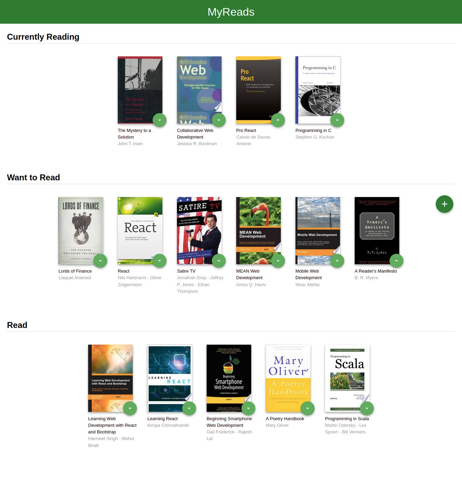
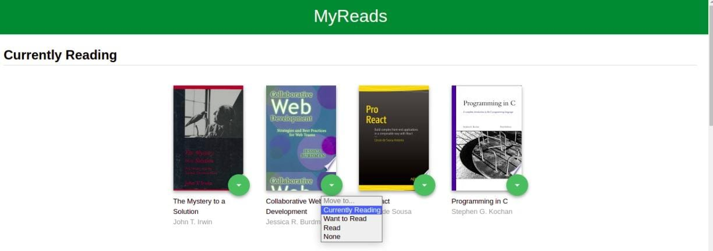
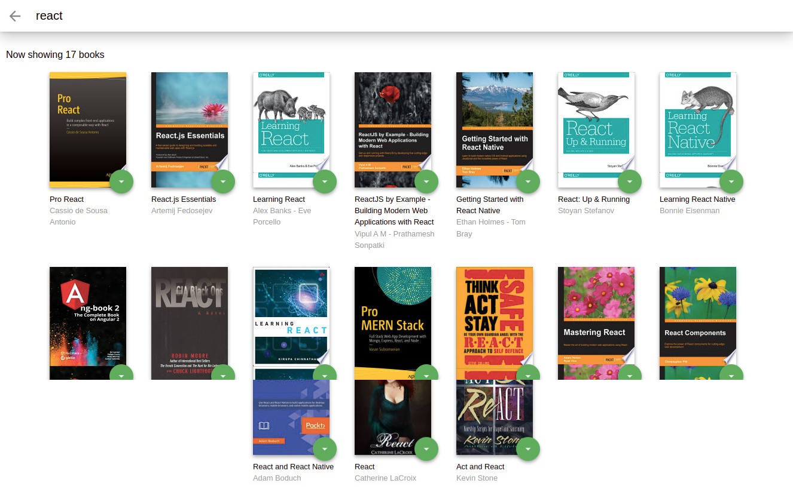

# MyReads Project (React JS)
---

## Project OverView:

The overview of the project is like a book store to display number of shelves, and every shelf conains number of books.
You can search about the book you want by typing the author's name or subject of it in the search bar.
You can set the states of the book and move it between shelves (Currently Reading, Want to Read and Read).

## How to Load the App

The project uses Node.js and the Create-React-App starter.  If you do not have Node >= 6.x installed, you can download it here: [Node.js](https://nodejs.org/en/)

```
git clone https://github.com/ShimaaHussien600/MyReadsProject.git
```

- install all project dependencies with

```
npm install
```

Once all of the dependencies have been installed you can launch the app with

```
npm start
```

A new browser window should automatically open displaying the app.  If it doesn't, navigate to [http://localhost:3000/](http://localhost:3000/) in your browser



## How to Use the App
* Books are Displayed into three shelves: Currently Reading, Want to Read and Read.
* You can move any book from it's shelf to another or remove a book from shelf, click on the green button on  the book cover


* To add or search for new books, click on the green + button at the bottom of the page.
Enter an author's name or subject.



### Resources and Documentation:
- [Create-react-app Documentation](https://github.com/facebookincubator/create-react-app)
- [React Router Documentation](http://knowbody.github.io/react-router-docs/)
- [React API](https://facebook.github.io/react/docs/react-api.html)

### Udacity Resources:
- [Project starter template](https://github.com/udacity/reactnd-project-myreads-starter)
- [Project Rubric](https://review.udacity.com/#!/rubrics/918/view)
- [Udacity JavaScript Style Guide](http://udacity.github.io/frontend-nanodegree-styleguide/javascript.html)


## Important

The backend API uses a fixed set of cached search results and is limited to a particular set of search terms, which can be found in [SEARCH_TERMS.md](SEARCH_TERMS.md). That list of terms are the _only_ terms that will work with the backend, so don't be surprised if your searches for Basket Weaving or Bubble Wrap don't come back with any results.